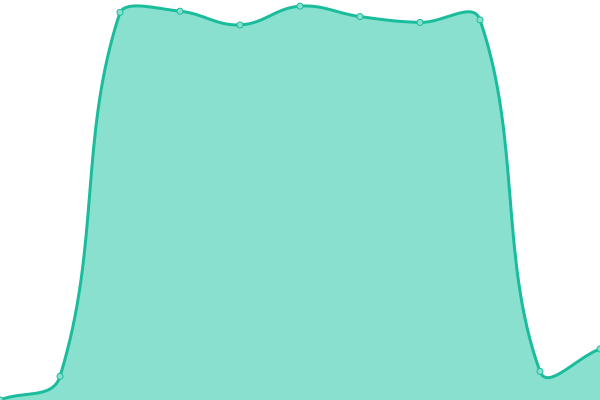

# [📈 Live Status](https://status.oxybill.com): <!--live status--> **🟥 Complete outage**

This repository contains the open-source uptime monitor and status page for [JustInClicks.com](https://www.justinclicks.com), powered by [Upptime](https://github.com/upptime/upptime).

With [Upptime](https://upptime.js.org), you can get your own unlimited and free uptime monitor and status page, powered entirely by a GitHub repository. We use [Issues](https://github.com/justinclicks-com/status.oxybill.com/issues) as incident reports, [Actions](https://github.com/justinclicks-com/status.oxybill.com/actions) as uptime monitors, and [Pages](https://status.oxybill.com) for the status page.

<!--start: status pages-->
<!-- This summary is generated by Upptime (https://github.com/upptime/upptime) -->
<!-- Do not edit this manually, your changes will be overwritten -->
<!-- prettier-ignore -->
| URL | Status | History | Response Time | Uptime |
| --- | ------ | ------- | ------------- | ------ |
|  [OxyBill App](https://app.oxybill.com) | 🟥 Down | [oxy-bill-app.yml](https://github.com/JustInClicks-com/status.oxybill.com/commits/HEAD/history/oxy-bill-app.yml) | 

 0ms
     
 | 

<a href="https://status.oxybill.com/history/oxy-bill-app">0.00%</a>
    

|  [Main Site](https://www.oxybill.com) | 🟥 Down | [main-site.yml](https://github.com/JustInClicks-com/status.oxybill.com/commits/HEAD/history/main-site.yml) | 

 0ms
     
 | 

<a href="https://status.oxybill.com/history/main-site">0.00%</a>
    

|  [Docs OxyBill](https://docs.oxybill.com) | 🟥 Down | [docs-oxy-bill.yml](https://github.com/JustInClicks-com/status.oxybill.com/commits/HEAD/history/docs-oxy-bill.yml) | 

 0ms
     
 | 

<a href="https://status.oxybill.com/history/docs-oxy-bill">0.00%</a>
    

<!--end: status pages-->

[**Visit our status website →**](https://status.oxybill.com)

## 📄 License

- Powered by: [Upptime](https://github.com/upptime/upptime)
- Code: [MIT](./LICENSE) © [JustInClicks.com](https://www.justinclicks.com)
- Data in the `./history` directory: [Open Database License](https://opendatacommons.org/licenses/odbl/1-0/)
